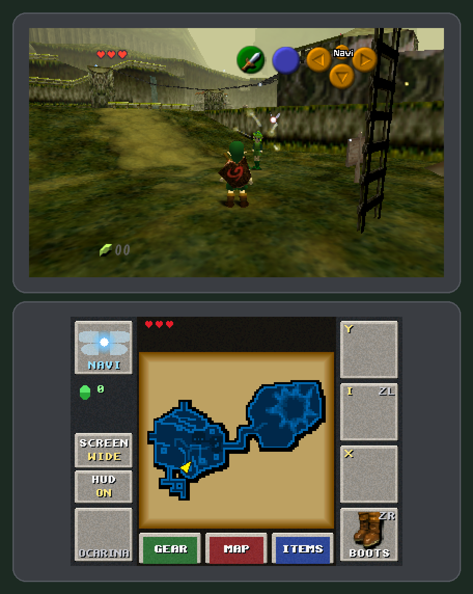
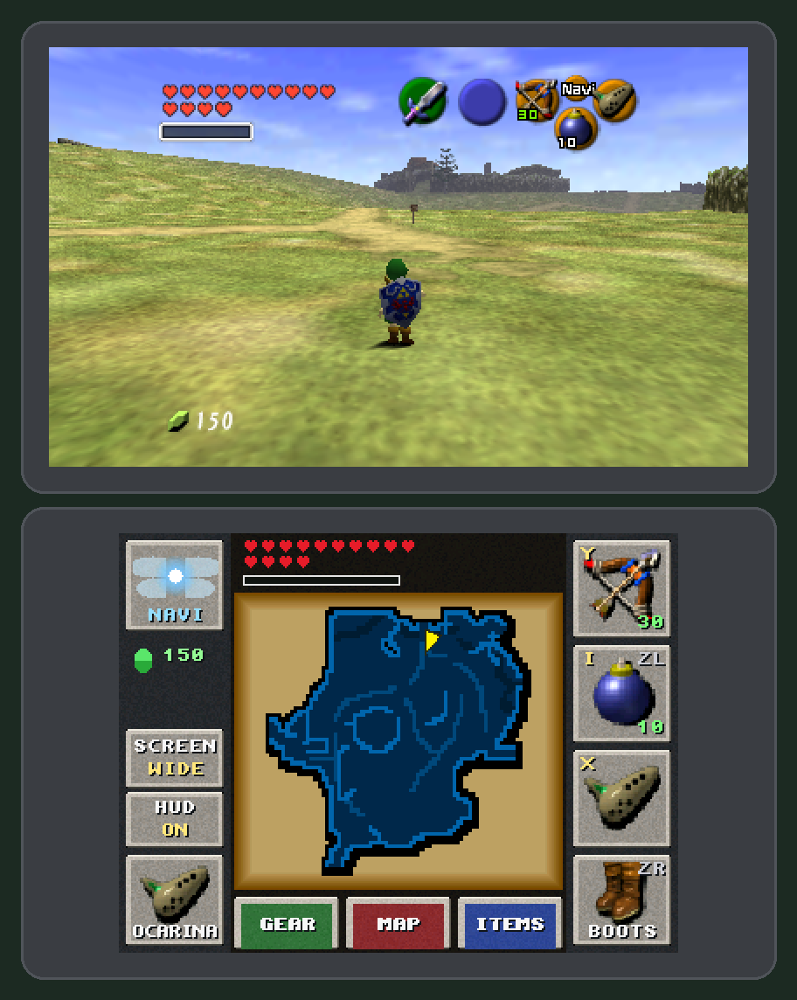
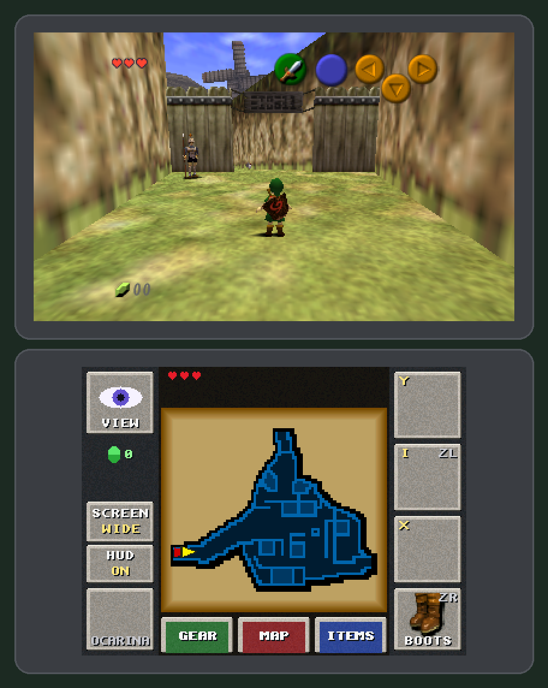
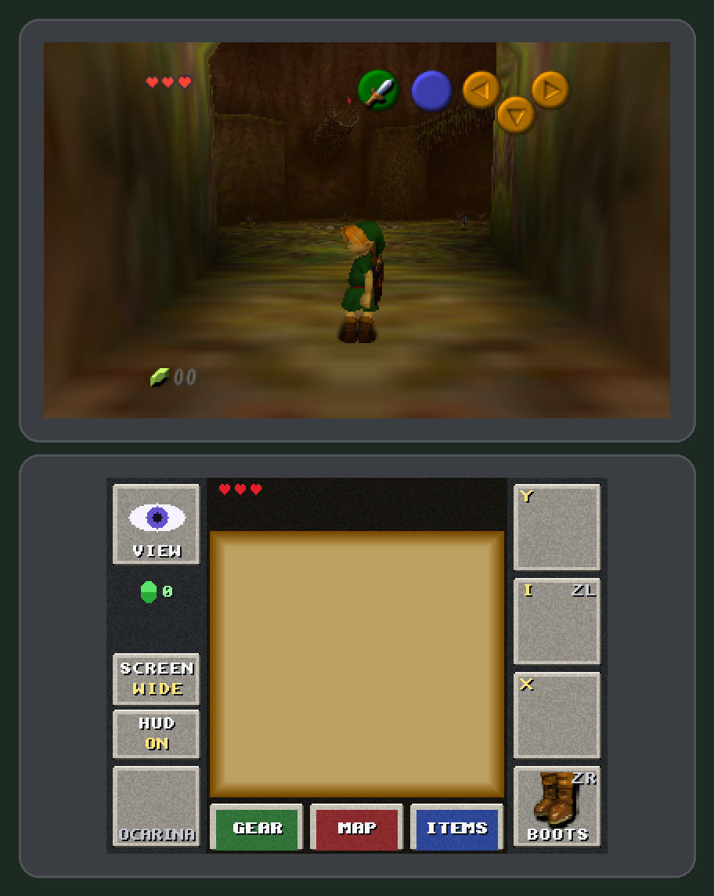

# The Legend of Zelda: Ocarina of Time N64 3DS Port

<p align="center">
  
</p>

A fan-made **native** Nintendo 3DS port of The Legend of Zelda: Ocarina of Time (N64), built on the
[zeldaret/oot](https://github.com/zeldaret/oot) decompilation. The game's own code runs natively on the 3DS
CPU; a new renderer, audio backend and dual-screen interface replace the N64 hardware.

> **This repository contains no ROM and no game assets.** To build and play, you need your own legally
> obtained copy of the N64 game (NTSC-U 1.0). No prebuilt game binaries are distributed; see [Legal](#legal).

This project is not affiliated with, endorsed by, or sponsored by Nintendo.

<p align="center">
  
  
  
</p>

## Features

- **Both consoles:** New 3DS at 60 frames per second, Old 3DS at the game's full speed with fewer frames shown
  (see [Status](#status)).
- **Top screen:** 400×240 gameplay, original 4:3 or widescreen (toggle on the touch screen, saved).
- **Stereoscopic 3D** with the 3D slider: automatic convergence on Link, HUD and menus at screen depth.
- **Bottom screen:** live minimap with Link's position and chest
  markers, hearts and magic, rupees and keys, touch buttons for the C items (with ammo), first person / Navi
  (the button pulses when Navi wants to talk, also with the top-screen HUD off),
  a dedicated **Ocarina** button, a **Boots** button that cycles the boots you own, and shortcuts to the
  Gear / Map / Items pause pages.
- **Optional top-screen HUD** (on by default, can be hidden from the touch screen).
- **60 fps by frame interpolation:** the game logic keeps the N64's 20 updates per second, and in-between
  frames are drawn from the game's own transforms (`fps60=0` shows the N64's 20).
- **Accuracy work:** the renderer is compared frame by frame against the N64 running the same inputs
  (tools in `tools/statediff`), and the audio is compared against the N64's output.
- Saves to the SD card (`sdmc:/3ds/oot/save.bin`).
- A HOME Menu banner: original artwork (the title and an ocarina under a night sky), or Link as the game draws
  him when you build it from your game data (see Building).

## Status

Every scene of the game loads for both ages, and the game state matches the N64's (compared field by field
with the N64 running the same inputs). A full playthrough on hardware is still in progress, so keep backups of
`sdmc:/3ds/oot/save.bin`. Remaining items for 1.0: [docs/RELEASE_1.0.md](docs/RELEASE_1.0.md).

| | New 3DS | Old 3DS |
|---|---|---|
| Game speed (N64 = 20 updates/s) | full speed | full speed |
| Frames shown per second | 60 in 2D and 3D (measured on hardware) | depends on the scene: about 15–17 in the biggest (Kokiri Forest), around 45 in interiors such as Link's house, fewer in 3D (measured on a New 3DS running at Old 3DS speed with the Old 3DS's thread layout, and in the emulator at Old 3DS speed); 60 everywhere is still being worked on |
| Stereoscopic 3D | yes | yes |

Measurements and the work behind them: [docs/3ds-60fps-plan.md](docs/3ds-60fps-plan.md).

## Requirements

- A Nintendo 3DS family console with custom firmware ([Luma3DS](https://github.com/LumaTeam/Luma3DS)) and
  [FBI](https://github.com/lifehackerhansol/FBI) (or another CIA installer).
- Your own **N64 Ocarina of Time NTSC-U 1.0** ROM in big-endian `.z64` format
  (MD5 `5bd1fe107bf8106b2ab6650abecd54d6`).
- The 3DS DSP firmware dump for sound: `sdmc:/3ds/dspfirm.cdc`. Luma3DS creates it from your own console:
  Rosalina menu (L + D-pad down + SELECT) → Miscellaneous options → **Dump DSP firmware**.
- A computer to build on (Linux, macOS, or Windows with WSL; see [Building](#building)) with [devkitPro](https://devkitpro.org/wiki/Getting_Started)
  (`3ds-dev`: devkitARM, libctru, citro3d, picasso) and `makerom` from
  [Project_CTR](https://github.com/3DSGuy/Project_CTR/releases) on your `PATH` (not part of devkitPro).

## Building

The build runs on Linux, macOS and Windows (in WSL). Step 1 installs the tools and differs per system; steps 2-5
are the same everywhere.

### 1. Install the tools

You need devkitPro's 3DS toolchain, `makerom` (it makes the `.cia` and `.3ds` files; not part of devkitPro) and the
decompilation's tools: Python 3.10 or newer, a MIPS binutils, a C compiler, `make`, `curl` and libxml2.

**Linux** (Debian 12, Ubuntu 22.04 or newer):
```bash
sudo apt-get update
sudo apt-get install git build-essential curl unzip python3 python3-venv python3-pip libxml2-dev \
                     binutils-mips-linux-gnu
# devkitPro and its 3DS toolchain
curl -LO https://apt.devkitpro.org/install-devkitpro-pacman
chmod +x install-devkitpro-pacman && sudo ./install-devkitpro-pacman
sudo dkp-pacman -S 3ds-dev
# makerom
curl -LO https://github.com/3DSGuy/Project_CTR/releases/download/makerom-v0.18.4/makerom-v0.18.4-ubuntu_x86_64.zip
unzip makerom-v0.18.4-ubuntu_x86_64.zip && chmod +x makerom && sudo mv makerom /usr/local/bin/
```

**Windows 10 or 11:** the decompilation's tools are Linux programs, so the build runs in WSL (Windows Subsystem
for Linux).
1. Open PowerShell as administrator, run `wsl --install`, restart the PC, then open **Ubuntu** from the Start menu
   and create your Linux user.
2. In the Ubuntu window, run the **Linux** commands above, then steps 2-5 below. Clone the repository in your Linux
   home folder (`cd ~` first), not under `/mnt/c`: building from the Windows drive is much slower and Windows line
   endings break the build.
3. Your Windows files are under `/mnt/c`, e.g. the ROM: `cp "/mnt/c/Users/<you>/Downloads/<rom>.z64" ...`
   (step 2). When the build is done, copy the CIA out: `cp build/3ds/oot.cia /mnt/c/Users/<you>/Desktop/`.

**macOS** (Apple Silicon or Intel, with [Homebrew](https://brew.sh)):
```bash
xcode-select --install          # Apple's compilers, if not installed yet
brew install coreutils make gsed bash libxml2 libiconv python@3.12 mips-linux-gnu-binutils
# devkitPro: install devkitpro-pacman-installer.pkg from https://github.com/devkitPro/pacman/releases/latest, then
sudo dkp-pacman -S 3ds-dev
# makerom (macos_arm64 for Apple Silicon, macos_x86_64 for Intel)
curl -LO https://github.com/3DSGuy/Project_CTR/releases/download/makerom-v0.18.4/makerom-v0.18.4-macos_arm64.zip
unzip makerom-v0.18.4-macos_arm64.zip && chmod +x makerom && mv makerom "$(brew --prefix)/bin/"
```
On macOS, use `gmake` (Homebrew's make) instead of `make` in steps 3 and 4: the system's make is too old. The
system's `python3` is too old too (3.9): before step 3, create the build's Python environment with Homebrew's
(`python3.12 -m venv .venv`, in the repository).

### 2-5. Build (all systems)

```bash
# 2. The code and your ROM (never commit the ROM; *.z64 is ignored by git)
git clone https://github.com/Andresac90/OOT-64-3DS-Port.git
cd OOT-64-3DS-Port
cp /path/to/your/oot-us-1.0.z64 baseroms/ntsc-1.0/baserom.z64
export DEVKITPRO=/opt/devkitpro DEVKITARM=/opt/devkitpro/devkitARM

# 3. Extract the assets from your ROM (the decompilation's setup step)
make setup VERSION=ntsc-1.0

# 4. Generate the sources the 3DS build includes (textures, soundfonts, text). COMPARE=0: the N64 ROM it also
#    builds differs from the retail one (the port changes shared sources), which is expected
make VERSION=ntsc-1.0 COMPARE=0 -j8

# 5. Build the 3DS port
make -f Makefile.3ds cia             # -> build/3ds/oot.cia (install with FBI)
make -f Makefile.3ds cci             # -> build/3ds/oot.3ds (for the Azahar emulator)
```

Step 3 also creates `baseroms/ntsc-1.0/baserom-decompressed.z64`, which the game reads at run time.

**Optional, Link and Navi on the HOME Menu, from your game data** (needs the Azahar emulator and Python 3.10+
with Pillow): `python3 tools/make_link_banner.py` captures Link as the game draws him (the pause menu's preview of
his 3D model) and makes the HOME Menu banner from it: Link on white (`port/banner_local.bnr`; also needs
[bannertool](https://github.com/diasurgical/bannertool)), and `python3 tools/make_navi_icon.py` renders Navi into the icon (`port/icon_local.png`). Run them before step 5; later builds use them. These files
are made from Nintendo's models, so they are ignored by git and must never be shared; without them the build uses
the original artwork (a drawn fairy and an ocarina).

**Troubleshooting (macOS):** if Anaconda or Miniconda is on your `PATH`, the audio tools can link against
its libxml2 and then fail with `Library not loaded: @rpath/libxml2.2.dylib`. Run steps 3 and 4 with conda
removed from `PATH` (or after `conda deactivate`), then rebuild `tools/`.

Detailed notes, emulator testing and debugging tools: [docs/BUILDING_3DS.md](docs/BUILDING_3DS.md).

## Installation

1. Install `build/3ds/oot.cia` with FBI. Updating from a development build: if the HOME Menu still shows the old
   icon or banner, delete the title in FBI and install again (saves are on the SD card and stay). Builds before
   October 2026 used the title ID `0xF8000`: delete that title once.
2. Copy `baseroms/ntsc-1.0/baserom-decompressed.z64` to the SD card as:
   ```
   sdmc:/3ds/oot/baserom-decompressed.z64
   ```
3. Make sure `sdmc:/3ds/dspfirm.cdc` exists (see Requirements).
4. Launch *The Legend of Zelda: Ocarina of Time N64 3DS Port* from the HOME Menu.

## Controls

| 3DS | Game | Notes |
|---|---|---|
| Circle Pad | Control Stick | |
| A / B | A / B | |
| Y / X | C-Left / C-Right | item buttons |
| L | Z (target) | |
| R | R (shield) | |
| START | START (pause) | |
| SELECT | L (minimap on/off) | |
| D-Pad | C buttons | the N64 D-pad is unused by the game |
| ZL (New 3DS) | C-Down | third item (touch pad "I") |
| ZR (New 3DS) | Boots | cycles the owned boots (touch pad BOOTS) |
| C-Stick (New 3DS) | camera | `cstick=0` makes it the C buttons |
| Touch screen | VIEW, items, Ocarina, Boots, pause pages, 4:3 / wide, top HUD | |

Every action is reachable on an Old 3DS without ZL/ZR or the C-Stick. Details:
[docs/3ds-touch-panel.md](docs/3ds-touch-panel.md).

## Settings

Most options are on the touch screen and are saved to `sdmc:/3ds/oot/settings.txt`. A few more can be set by
editing that file (one `name=value` per line):

| Setting | Default | Effect |
|---|---|---|
| `widescreen` | 0 | 1 = widescreen, 0 = original 4:3 (also on the touch screen) |
| `hud` | 1 | top-screen HUD on/off (also on the touch screen) |
| `fps60` | 1 | 60 fps frame interpolation; 0 = the N64's 20 frames per second |
| `frameskip` | automatic | 1 = skip drawing an update when the game falls behind (default on Old 3DS), 0 = never |
| `cstick` | 1 | New 3DS C-Stick: 1 = camera, 0 = the four C buttons |
| `aa` | 0 | 1 = anti-aliasing: smoother edges, but more than twice the GPU work (the frame rate drops well below 60) |
| `audio_share` | 55 | Old 3DS: percent of the system core for the audio mixer (less: crackling; more: slower system services) |
| `speed_rules` | 1 | Old 3DS speed rules: every triangle on the GPU's fast path, no N64 screen-linear shading splits, the GPU clips at the near plane (1 = while frames are skipped, i.e. on an Old 3DS; 2 = always; 0 = never: the N64-exact rules) |

### Diagnostics

For bug reports and measurements only; the defaults are the fastest and most accurate settings.

| Setting | Default | Effect |
|---|---|---|
| `prof` | 0 | 1 = per-stage CPU profile and performance figures in `boot.log` (for bug reports about speed) |
| `render_thread` | 1 | New 3DS: draw on core 2 while the game computes the next update; 0 = one core |
| `overlap` | 1 | 1 = the CPU prepares the next frame while the GPU draws; 0 = one at a time |
| `raw_vtx` | 1 | 1 = the GPU's vertex shader does the N64's per-vertex work on the game's own vertices; 0 = the CPU prepares every vertex |
| `raw_ratio` | 30 | geometry whose far side is more than this / 10 times farther than its near side stays on the CPU path, which reproduces the N64's screen-linear shading |
| `fastswitch` | 1 | 0 = switch between the two vertex programs through citro3d (for graphics bug reports) |
| `replay_copy` | 1 | 1 = 60 fps in-between frames are copies of the first frame's GPU commands with the matrices patched; 0 = each replays the draw log (`replay_copy_check=1` compares both) |
| `audio_margin` | automatic | samples kept queued for the DSP beyond the current frame (Old 3DS: 512, against crackling) |
| `gpu_vtx` | 1 | vertex processing on the GPU; 0 = on the CPU |
| `o3ds_sim`, `o3ds_layout` | 0 | on a New 3DS: 1 = Old 3DS speed (268 MHz, no L2 cache) / the Old 3DS thread layout |
| `perf_ab`, `raw_vtx_ab`, `render_thread_ab`, `audio_share_ab`, `replay_copy_ab`, `speed_rules_ab`, ... | 0 | 1 = alternate one option during a session to compare both in `boot.log` |

For testing, a second set of settings can sit next to the first: if `sdmc:/3ds/oot/settings_b.txt` exists, holding
L while the game starts uses it instead of `settings.txt` (read from it and saved to it), so two setups can be
switched on the console. Without that file, holding L at start does nothing.

## Bug reports

Please open an issue with the console model (Old / New 3DS), what happened and where in the game, and attach
`sdmc:/3ds/oot/boot.log` from the session (each launch rewrites it and keeps the previous one as
`boot_prev.log`). A photo of the screen helps for graphics issues; `prof=1` in `settings.txt` adds performance
figures to the log.

## Legal

- This repository contains source code, build scripts and tools only. It does **not** contain a ROM,
  extracted game assets, or any other Nintendo data. Nintendo, Nintendo 3DS, *The Legend of Zelda* and
  *Ocarina of Time* are trademarks of Nintendo; all game content belongs to Nintendo.
- The game data is extracted from **your own ROM on your own computer** at build time, and the build
  embeds it into the binary. For that reason **no `.cia`, `.3dsx` or `.3ds` builds are published** here or in
  releases: each user builds their own from their own copy of the game. Please do not upload built binaries.
- You must own the game: dump the ROM from your own cartridge. Do not ask for or share ROMs in this
  repository's issues.
- This is a non-commercial fan project, made for preservation and to play a game you own on hardware you
  own. It is provided as is, without warranty of any kind.

## Credits

- [zeldaret/oot](https://github.com/zeldaret/oot): the Ocarina of Time decompilation this port is built on.
  Its original README is kept in [docs/DECOMP_README.md](docs/DECOMP_README.md).
- The [Super Mario 64 PC port](https://github.com/sm64-port/sm64-port) (Fast3D renderer) and the
  [Super Mario 64 3DS port](https://github.com/mkst/sm64-port/tree/3ds-port) (citro3d backend), which the
  renderer started from.
- [Ship of Harkinian](https://github.com/HarbourMasters/Shipwright) and
  [libultraship](https://github.com/Kenix3/libultraship): reference for the audio mixer math and renderer
  details. Ship of Harkinian's frame interpolation design also informed this port's.
- [Zelda64Recomp](https://github.com/Zelda64Recomp/Zelda64Recomp) and [RT64](https://github.com/rt64/rt64):
  reference for the transform tagging used by the 60 fps interpolation.
- The [Super Mario 64 3DS port by Wyatt-James](https://github.com/Wyatt-James/sm64-3ds-port) ("Emu64": N64
  vertices processed by the 3DS vertex shader) and [gdx-3ds](https://github.com/cruxxxxxx/gdx-3ds) (render
  thread on the New 3DS, hardware findings): design references.
- [devkitPro](https://devkitpro.org/), libctru and citro3d; [stb_image](https://github.com/nothings/stb);
  the [Azahar](https://github.com/azahar-emu/azahar) emulator and the [ares](https://ares-emu.net/) N64
  emulator, used for testing.
- Built with the help of Claude (Anthropic).

Licenses and terms of the code this port builds on: [THIRD_PARTY_NOTICES.md](THIRD_PARTY_NOTICES.md).

## Documentation

- [docs/BUILDING_3DS.md](docs/BUILDING_3DS.md): build, emulator testing and debugging
- [docs/3ds-touch-panel.md](docs/3ds-touch-panel.md): controls, touch panel, minimap
- [docs/3ds-stereo-3d.md](docs/3ds-stereo-3d.md): stereoscopic 3D design
- [docs/3ds-60fps-plan.md](docs/3ds-60fps-plan.md): performance and 60 fps work
- [docs/RELEASE_1.0.md](docs/RELEASE_1.0.md): what was verified for 1.0, and how
- [PORT_ROADMAP.md](PORT_ROADMAP.md): development history (bring-up notes)
